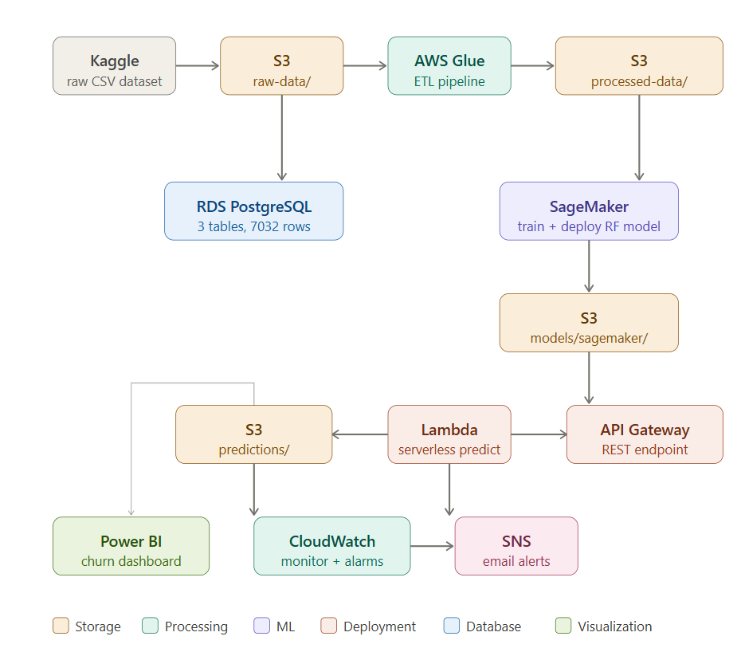
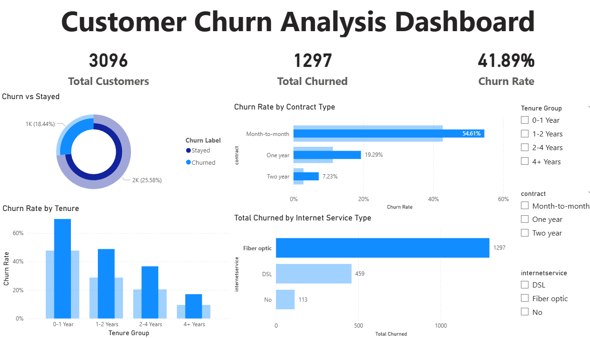

# 🔄 Customer Churn Prediction — End-to-End AWS ML Pipeline


A production-grade, end-to-end machine learning pipeline built entirely on AWS to predict customer churn for a telecom company. From raw data ingestion to a live REST API and interactive business dashboard — every layer of the modern data science stack is covered.

---

## 🏗️ Architecture



```
Kaggle Dataset
     │
     ▼
 S3 (raw-data/)
     │
     ▼
 AWS Glue ETL ──────────────────────────────────────────┐
     │                                                   │
     ▼                                                   ▼
 S3 (processed-data/)                          RDS PostgreSQL
     │                                         ├── customers
     ▼                                         ├── customers_cleaned
 SageMaker                                     └── customers_features
 (Train + Deploy)
     │
     ▼
 S3 (models/sagemaker/model.tar.gz)
     │
     ▼
 AWS Lambda ◄─── API Gateway (REST API)
     │
     ├──► S3 (predictions/)
     ├──► SNS (email alerts)
     └──► CloudWatch (monitoring)
          │
          ▼
     Power BI Dashboard
```

---

## ☁️ AWS Services Used

| Service | Purpose |
|---|---|
| **S3** | Raw data, processed data, model artifacts, predictions |
| **RDS PostgreSQL** | Structured data storage — 3 tables, 7032 rows |
| **Glue** | ETL pipeline — clean and transform raw data |
| **SageMaker** | Model training and endpoint deployment |
| **Lambda** | Serverless prediction API function |
| **API Gateway** | REST API endpoint — live predictions |
| **CloudWatch** | Pipeline monitoring, dashboards, alarms |
| **SNS** | Email alerts when churn rate exceeds threshold |
| **IAM** | Roles and permissions management |

---

## 📊 Model Performance

| Model | Accuracy | ROC-AUC | Churn Recall |
|---|---|---|---|
| Random Forest (Local) | 77.61% | 0.8419 | 74% |
| Random Forest (SageMaker) | 77.61% | 0.8419 | 74% |
| XGBoost (Local) | 76.19% | 0.8369 | 76% |

**Production model:** Random Forest trained on SageMaker — stored as `model.tar.gz` in S3

---

## 🔍 Key Business Insights

Discovered from EDA and SQL analysis on 7,032 telecom customers:

- **Month-to-month contracts** churn at **42.71%** vs only **2.83%** for two-year contracts — a 15x difference
- **New customers (0-1 year tenure)** churn at nearly **47%** — highest risk group by far
- **Senior citizens** churn at **41.68%** vs **23.61%** for non-seniors — nearly double
- **Fiber optic users** account for the most churned customers in absolute numbers
- **Overall churn rate:** 26.58% (1,869 out of 7,032 customers)

---

## 🛠️ Tech Stack

| Layer | Technology |
|---|---|
| Language | Python 3.11 |
| ML Framework | scikit-learn 1.4.2, XGBoost |
| Data Processing | pandas, NumPy |
| Database | PostgreSQL (AWS RDS) |
| Cloud | AWS (S3, Glue, SageMaker, Lambda, API Gateway, SNS, CloudWatch) |
| Visualization | matplotlib, seaborn, Power BI |
| Version Control | Git + GitHub |
| Containerization | Docker (Lambda package build) |
| API Testing | Python requests, Postman |

---

## 📁 Project Structure

```
churn-project/
│
├── data/
│   ├── telco-churn-raw.csv          # Original Kaggle dataset
│   ├── telco-churn-cleaned.csv      # Glue ETL output
│   └── churn_features.csv           # Feature engineered data
│
├── models/
│   ├── churn_model_rf.pkl           # Random Forest (local)
│   └── churn_model_xgb.pkl          # XGBoost (local)
│
├── notebooks/
│   ├── churn_sagemaker_training.ipynb  # SageMaker training notebook
│   └── churn_dashboard.pbix            # Power BI dashboard file
│
├── plots/
│   ├── plot1_churn_distribution.png
│   ├── plot2_churn_by_contract.png
│   ├── plot3_tenure_vs_churn.png
│   ├── plot4_monthlycharges_vs_churn.png
│   ├── plot5_churn_by_internet.png
│   ├── plot6_correlation_heatmap.png
│   ├── plot7_confusion_matrix.png
│   ├── plot8_feature_importance.png
│   ├── architecture_diagram.png
│   └── dashboard_screenshot.png
│
├── scripts/
│   ├── load_data.py                 # Load raw data to RDS
│   ├── load_cleaned_data.py         # Load Glue output to RDS
│   ├── eda.py                       # Exploratory data analysis
│   ├── feature_engineering.py       # Feature engineering pipeline
│   ├── train_rf.py                  # Train Random Forest locally
│   ├── train_xgb.py                 # Train XGBoost locally
│   ├── upload_to_s3.py              # Upload artifacts to S3
│   ├── test_api.py                  # Test live API endpoint
│   ├── check_predictions.py         # View stored predictions
│   ├── sns_alert.py                 # Trigger SNS churn alert
│   └── run_all_tests.py             # End-to-end pipeline test
│
├── lambda_package/                  # Lambda deployment package
│   └── lambda_function.py           # Lambda handler
│
├── .gitignore
└── README.md
```

---

## 🚀 Pipeline Overview

### Step 1 — Data Ingestion
Raw Telco Customer Churn dataset (7,043 rows) uploaded to S3 `raw-data/` folder.

### Step 2 — ETL with AWS Glue
Glue job reads from S3, cleans data (drops 11 rows with blank `totalcharges`, converts churn to binary 0/1, standardizes column names), writes cleaned output back to S3 `processed-data/`.

### Step 3 — PostgreSQL on RDS
Cleaned data loaded into AWS RDS PostgreSQL (`churndb` database). Three tables maintained: raw, cleaned, and feature-engineered versions.

### Step 4 — Feature Engineering
23 features prepared for ML: binary encoding, one-hot encoding for categorical variables, StandardScaler for numeric columns.

### Step 5 — Model Training on SageMaker
Random Forest Classifier (200 trees, max_depth=12) trained on SageMaker notebook instance. Model artifact stored as `model.tar.gz` in S3.

### Step 6 — Serverless Deployment
Lambda function loads model from S3, serves predictions via API Gateway REST endpoint. Each prediction saved as JSON to S3 `predictions/` folder.

### Step 7 — Monitoring & Alerts
CloudWatch monitors Lambda invocations, errors, and duration. SNS sends email alerts when churn rate exceeds 35% threshold.

### Step 8 — Business Dashboard
Power BI connects to RDS PostgreSQL, visualizing churn rates by contract type, tenure, internet service, and customer segments.

---

## 🔌 API Usage

**Endpoint:**
```
POST https://{api-id}.execute-api.ap-south-1.amazonaws.com/prod/predict
```

**Request:**
```json
{
    "customer_id": "CUST-001",
    "features": {
        "seniorcitizen": 0,
        "partner": 1,
        "dependents": 0,
        "tenure": 24,
        "contract_Two year": 1,
        "monthlycharges": -0.5,
        "totalcharges": 0.3
    }
}
```

**Response:**
```json
{
    "customer_id": "CUST-001",
    "prediction": 0,
    "result": "NO CHURN",
    "churn_probability": 0.0518,
    "risk_level": "LOW",
    "model_version": "sagemaker-rf-v1",
    "predicted_at": "2026-03-22T06:57:29.526897"
}
```

---

## 📈 Power BI Dashboard



The dashboard connects live to RDS PostgreSQL and shows:
- Overall churn rate (26.58%)
- Churn by contract type
- Churn by tenure group
- Churn by internet service type
- Interactive slicers for filtering

Download: [`notebooks/churn_dashboard.pbix`](notebooks/churn_dashboard.pbix)

---

## ⚙️ How to Run

### Prerequisites
- Python 3.11
- AWS CLI configured (`aws configure`)
- AWS account with required permissions

### Setup
```bash
git clone https://github.com/AdityanRajesh7/churn-prediction-aws
cd churn-prediction-aws
pip install pandas numpy scikit-learn xgboost matplotlib seaborn sqlalchemy psycopg2-binary boto3
```

### Run End-to-End Test
```bash
cd scripts
python run_all_tests.py
```

### Test the Live API
```bash
python test_api.py
```

---

## 👤 Author

**Adityan**
- Built as a portfolio project demonstrating end-to-end AWS data science capabilities
- Timeline: 22 days of focused work
- Location: Kerala, India

---

## 📝 License

MIT License — feel free to use this as a reference for your own projects.
